# NEXUS – AI-Powered Campus Capability & Collaboration Network

> **Connect. Collaborate. Grow.**

NEXUS is an AI-powered campus collaboration and project management platform designed to help students discover peers, showcase their skills, explore suitable projects, collaborate effectively, and receive personalized career guidance.

The platform brings together student capabilities, skills, interests, projects, collaboration opportunities, and AI-powered recommendations into a single centralized system.

---

## 📌 Table of Contents

- [Overview](#-overview)
- [Key Features](#-key-features)
- [AI Implementation](#-ai-implementation)
- [Product Tour](#-product-tour)
- [System Architecture](#-system-architecture)
- [Database Design](#-database-design)
- [Technology Stack](#-technology-stack)
- [Project Structure](#-project-structure)
- [Getting Started](#-getting-started)
- [Future Enhancements](#-future-enhancements)
- [Academic Relevance](#-academic-relevance)
- [Author](#-author)

---

# 📖 Overview

Finding the right people to collaborate with is often difficult for students. Students may have valuable skills, interesting project ideas, or specific career goals, but there is usually no centralized platform to connect these capabilities.

**NEXUS** addresses this problem by creating a smart campus capability and collaboration network.

Students can:

- Create and manage their profiles
- Add technical skills and interests
- Discover other students with relevant capabilities
- Explore and join projects
- Manage project requirements and members
- Send collaboration requests
- Receive AI-powered project recommendations
- Generate personalized career roadmaps
- Track goals and achievements
- Manage certifications
- Receive notifications
- Raise support tickets through the Help & Support system

The system combines a relational database, REST APIs, authentication, a modern web interface, and Generative AI to provide a centralized student collaboration ecosystem.

---

# ✨ Key Features

## 👤 Student Profile Management

Students can create and manage their profiles with information such as:

- Name
- Email
- Roll number
- Department
- Specialization
- Year
- Section
- CGPA
- Bio
- GitHub profile
- LinkedIn profile
- Resume information
- Availability status

This profile acts as the student's digital capability identity within NEXUS.

---

## 🧠 Skills and Interests

Students can add and manage their:

- Programming languages
- Frameworks
- Database technologies
- Cloud technologies
- Development tools
- Artificial Intelligence and Machine Learning skills
- Personal and professional interests

This information helps represent student capabilities and supports intelligent recommendations and collaboration.

---

## 🔍 Student Discovery

Students can discover other students and explore potential collaboration opportunities based on available student information, skills, and interests.

This can support:

- Team formation
- Project collaboration
- Skill-based networking
- Academic projects
- Technical learning

---

## 📁 Project Management

Students can create and manage projects within the platform.

Projects can include:

- Project title
- Description
- Required skills
- Project members
- Project-related information

Students can explore projects and identify opportunities that match their capabilities.

---

## 🤝 Collaboration Requests

Students can send and manage collaboration requests with other students.

This allows users to formally express interest in:

- Joining projects
- Collaborating with other students
- Building teams
- Working toward shared goals

---

## 🤖 AI-Powered Project Recommendations

NEXUS includes AI-based project recommendation functionality.

Students can ask for recommendations about projects that may be suitable for them, for example:

> **Which projects are suitable for me?**

The AI-powered functionality can generate project suitability recommendations using relevant student and project information.

---

## 🗺️ AI Career Roadmap Generation

Students can generate personalized career roadmaps using Generative AI.

The roadmap can provide guidance based on information such as:

- Current skills
- Interests
- Academic background
- Career goals
- Potential areas for further development

This helps students understand possible learning paths and career development directions.

---

## 🎯 Goal Management

Students can create and track personal, academic, or professional goals.

Goals can help students organize their development journey and track progress toward objectives.

---

## 🏆 Achievements and Certifications

Students can maintain records of:

- Achievements
- Certifications
- Accomplishments

This allows the platform to represent student growth and development over time.

---

## 🔔 Notification System

The notification system keeps students informed about important platform activities such as:

- Collaboration requests
- Project-related updates
- Other relevant platform activities

---

## 🆘 Help & Support

NEXUS includes a dedicated **Help & Support** feature.

Students can raise support tickets for issues or questions related to the platform.

This provides a structured mechanism for handling user support requests.

---

# 🤖 AI Implementation

AI functionality is integrated into the NEXUS backend using the **Google GenAI SDK**.

The current configured model is:

```properties
gemini.model=gemini-3.6-flash
```

## Current AI Capabilities

### 1. Personalized Career Roadmap Generation

The AI generates career guidance and personalized career roadmaps.

### 2. AI Project Recommendations

Students can request AI assistance to determine which projects may be suitable for them.

The AI can generate project suitability recommendations based on relevant student capabilities and project information.

## AI Implementation Status

| AI Feature | Status |
|---|---|
| Google GenAI SDK Integration | ✅ Implemented |
| Gemini Model Integration | ✅ Implemented |
| AI Career Roadmap Generation | ✅ Implemented |
| AI Project Suitability Recommendations | ✅ Implemented |
| Advanced Recommendation Ranking | 🔄 Future Enhancement |

---

# 🖼️ Product Tour

The following screenshots demonstrate the major interfaces and features implemented in NEXUS.

> All screenshots are stored inside the project's `assets/` directory.

---

## 🏠 Landing Page

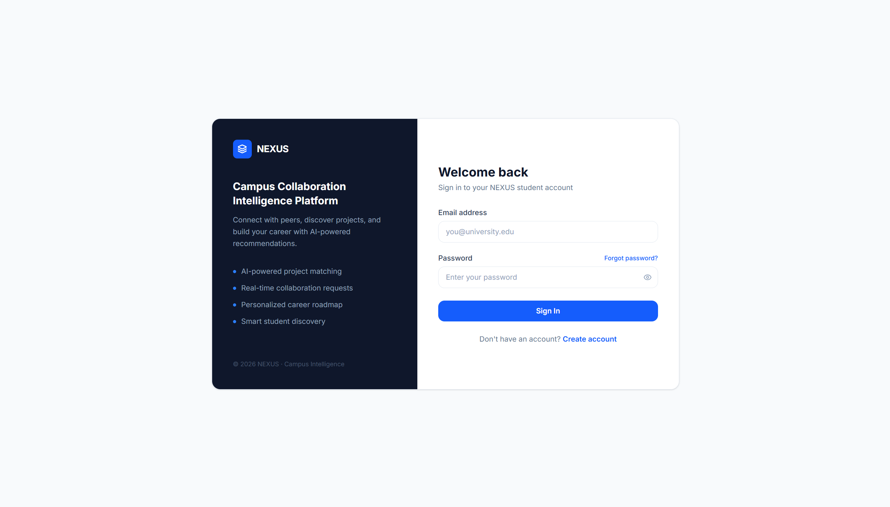

The landing page introduces NEXUS and provides an overview of the platform.

---

## 🔐 Create Account

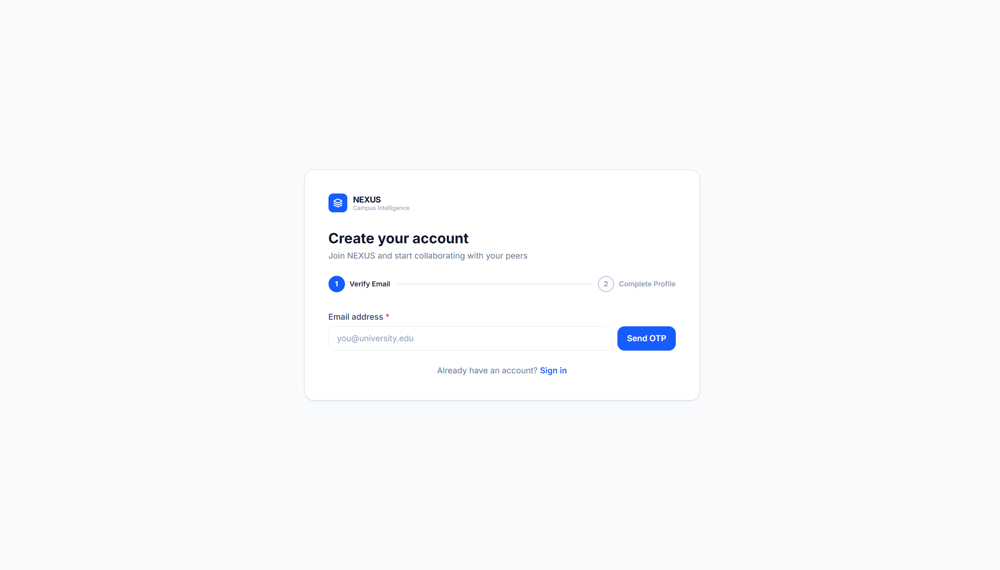

Students can create an account to access the NEXUS platform.

---

## 📊 Dashboard

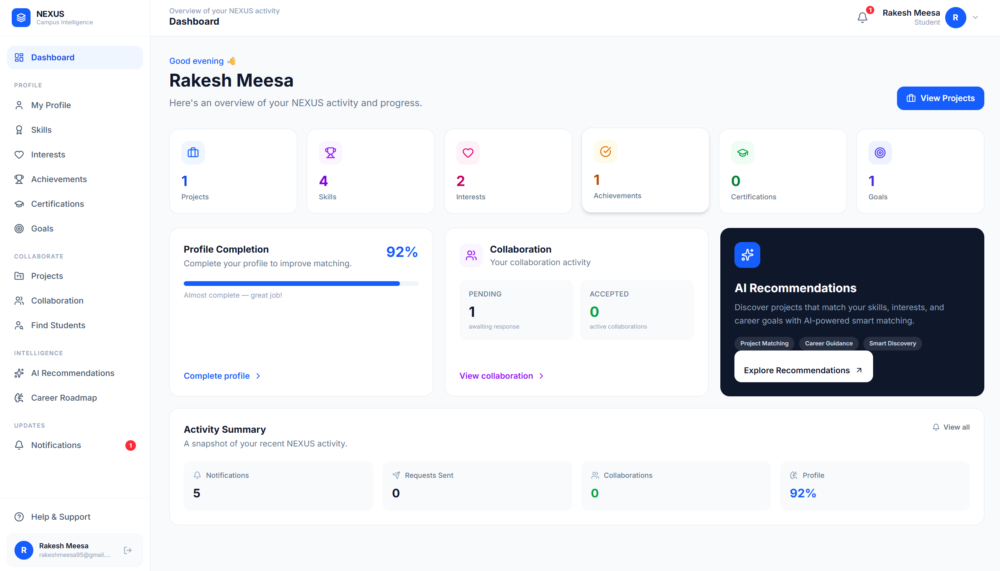

The dashboard provides an overview of student activities and important platform information.

---

## 👤 Student Profile

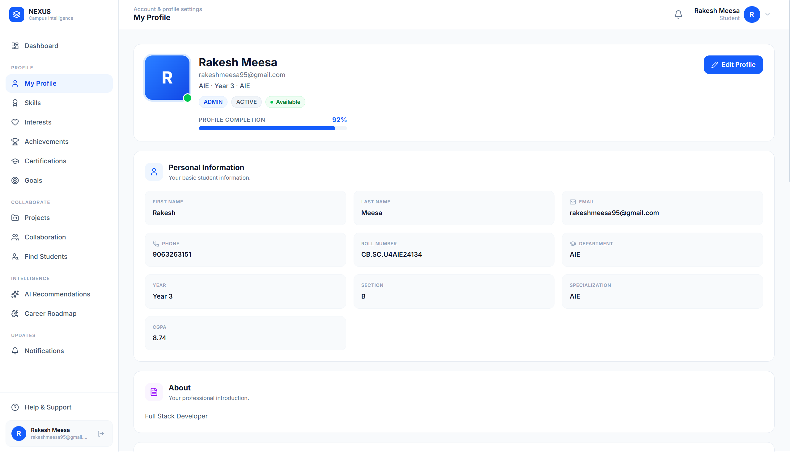

Students can manage their academic and professional profile information.

---

## 🧠 Skills & Interests

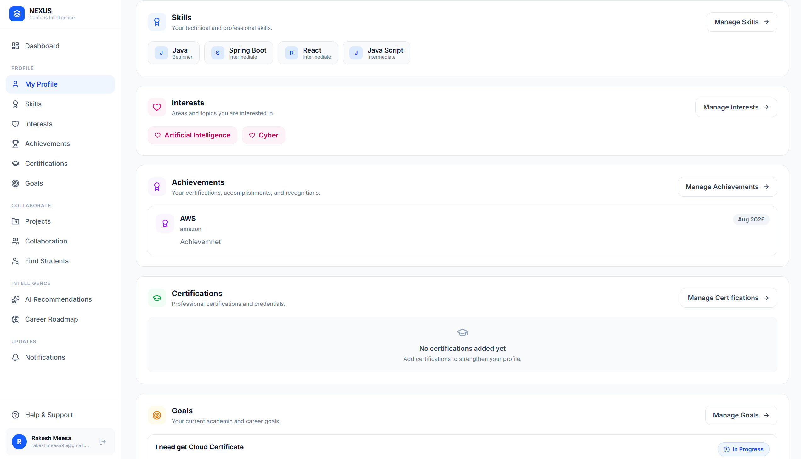

Students can add and manage their technical skills and interests.

---

## 🔍 Student Discovery

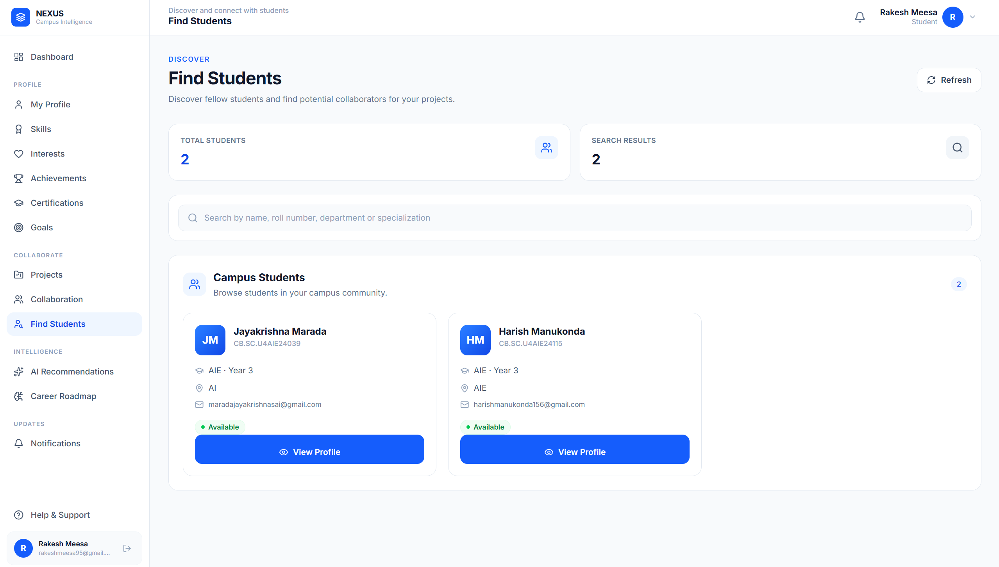

Students can discover other students and explore potential collaboration opportunities.

---

## 📁 Project Management

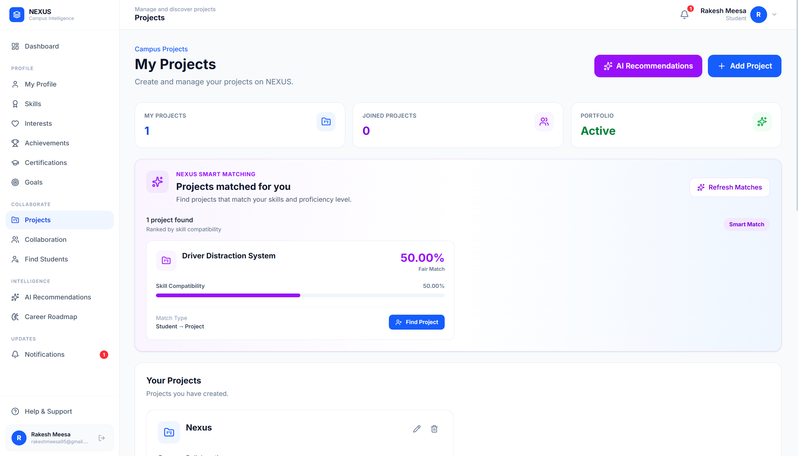

Students can explore and manage projects and identify opportunities that match their capabilities.

---

## 🤖 AI Project Recommendations

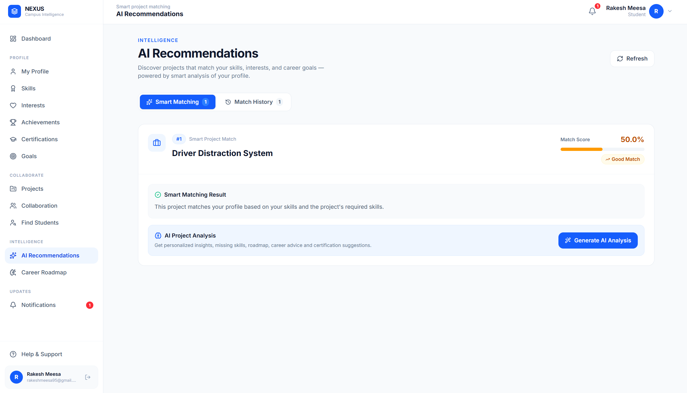

The AI recommendation feature helps students identify projects that may be suitable for their skills and capabilities.

---

## 🗺️ AI Career Roadmap

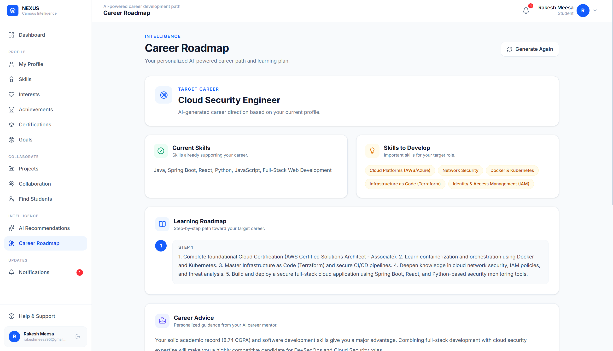

Students can generate personalized AI-powered career roadmaps.

---

## 🔔 Notifications

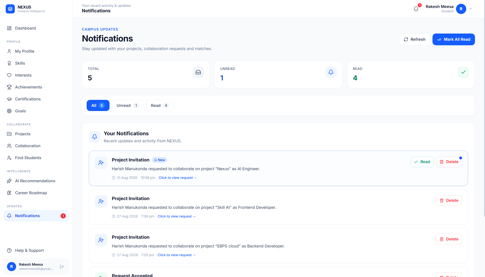

Students receive notifications related to important activities within the platform.

---

## 🆘 Help & Support

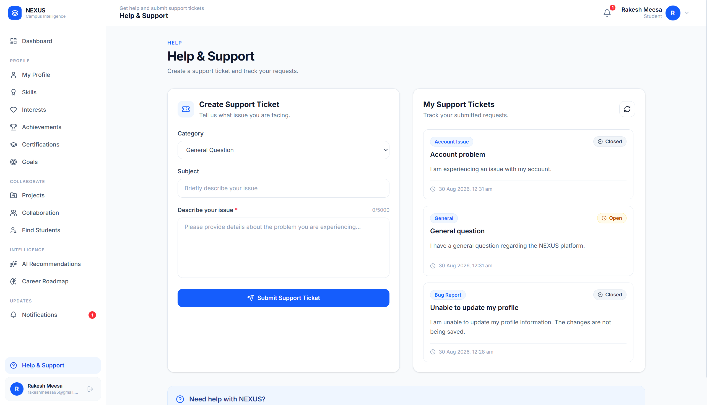

The Help & Support page allows students to access assistance and raise support tickets.

---

# 🏗️ System Architecture

NEXUS follows a layered client-server architecture.

```text
┌─────────────────────────────────────┐
│            STUDENT USER             │
│                                     │
│  Profile • Skills • Projects        │
│  Discovery • Career • Support       │
└──────────────────┬──────────────────┘
                   │
                   │ HTTP / REST API
                   ▼
┌─────────────────────────────────────┐
│        REACT + VITE FRONTEND        │
│                                     │
│  • User Interface                   │
│  • Client-Side Routing              │
│  • API Communication                │
│  • Notifications                    │
│  • AI Feature Interfaces            │
└──────────────────┬──────────────────┘
                   │
                   │ REST API Requests
                   ▼
┌─────────────────────────────────────┐
│          SPRING BOOT BACKEND        │
│                                     │
│  • Controllers                      │
│  • Services                         │
│  • DTOs                             │
│  • Validation                       │
│  • Exception Handling               │
│  • Business Logic                   │
└──────────────┬───────────┬──────────┘
               │           │
               │           │
               ▼           ▼
┌────────────────────┐  ┌─────────────────────┐
│ SPRING SECURITY    │  │   GOOGLE GEMINI AI  │
│                    │  │                     │
│ • Authentication   │  │ • Career Roadmap    │
│ • JWT              │  │ • Project           │
│ • Protected APIs   │  │   Recommendations   │
└──────────┬─────────┘  └─────────────────────┘
           │
           ▼
┌─────────────────────────────────────┐
│       SPRING DATA JPA / HIBERNATE   │
│                                     │
│          ORM & Data Access          │
└──────────────────┬──────────────────┘
                   │
                   ▼
┌─────────────────────────────────────┐
│           POSTGRESQL DATABASE       │
│                                     │
│           17 Core Entities          │
└─────────────────────────────────────┘
```

## Application Flow

```text
Student
   │
   ▼
React + Vite Frontend
   │
   │ REST API Requests
   ▼
Spring Boot Backend
   │
   ├── Authentication & Security
   ├── Student Management
   ├── Skill & Interest Management
   ├── Project Management
   ├── Collaboration Management
   ├── Career Roadmap Services
   ├── AI Recommendation Services
   └── Support Ticket Management
   │
   ▼
Spring Data JPA / Hibernate
   │
   ▼
PostgreSQL Database
```

## AI Flow

```text
Student Request
      │
      ▼
Spring Boot AI Service
      │
      ▼
Google Gemini Model
      │
      ▼
AI Generated Response
      │
      ├── Career Roadmap
      │
      └── Project Recommendation
```

---

# 🗄️ Database Design

NEXUS uses PostgreSQL as its relational database.

The system consists of **17 core entities**:

1. `Student`
2. `Skill`
3. `StudentSkill`
4. `Interest`
5. `StudentInterest`
6. `Project`
7. `ProjectMember`
8. `ProjectSkill`
9. `Goal`
10. `CollaborationRequest`
11. `MatchHistory`
12. `CareerRoadmap`
13. `Notification`
14. `Achievement`
15. `Certification`
16. `EmailOtp`
17. `SupportTicket`

---

# 🛠️ Technology Stack

## Frontend

- React 19
- Vite
- React Router
- Axios
- Tailwind CSS
- Lucide React
- React Hot Toast

## Backend

- Java 21
- Spring Boot 3.5.4
- Spring Web
- Spring Data JPA
- Spring Security
- Spring Validation
- Spring Mail
- Hibernate

## Database

- PostgreSQL

## Authentication

- Spring Security
- JWT

JWT implementation includes:

- `jjwt-api`
- `jjwt-impl`
- `jjwt-jackson`

## AI

- Google GenAI SDK
- Gemini

Current AI capabilities:

- Personalized Career Roadmap Generation
- AI-Based Project Recommendations

---

# 📂 Project Structure

```text
NEXUS/
│
├── .github/
├── .idea/
│
├── assets/
│   ├── nexus-ai-recommendation.png
│   ├── nexus-career-roadmap.png
│   ├── nexus-creat-account.png
│   ├── nexus-dashboard.png
│   ├── nexus-landing.png
│   ├── nexus-notification.png
│   ├── nexus-profile.png
│   ├── nexus-project.png
│   ├── nexus-skills-interests.png
│   ├── nexus-student-discovery.png
│   └── nexus-support.png
│
├── backend/
│   │
│   ├── .github/
│   ├── .mvn/
│   ├── docs/
│   │
│   ├── src/
│   │   │
│   │   ├── main/
│   │   │   │
│   │   │   ├── java/
│   │   │   │   │
│   │   │   │   └── com/
│   │   │   │       └── nexus/
│   │   │   │           └── backend/
│   │   │   │               │
│   │   │   │               ├── config/
│   │   │   │               ├── controller/
│   │   │   │               ├── dto/
│   │   │   │               ├── entity/
│   │   │   │               ├── exception/
│   │   │   │               ├── repository/
│   │   │   │               ├── security/
│   │   │   │               ├── service/
│   │   │   │               ├── util/
│   │   │   │               │
│   │   │   │               └── BackendApplication.java
│   │   │   │
│   │   │   └── resources/
│   │   │       ├── static/
│   │   │       ├── templates/
│   │   │       └── application.properties
│   │   │
│   │   └── test/
│   │
│   ├── target/
│   ├── .gitattributes
│   ├── .gitignore
│   ├── HELP.md
│   ├── mvnw
│   ├── mvnw.cmd
│   └── pom.xml
│
└── frontend/
    ├── src/
    ├── package.json
    └── vite.config.*
```

> The `backend/target/` directory is generated automatically by Maven and should generally not be committed to the repository.

---

# 🚀 Getting Started

## Prerequisites

Make sure the following are installed:

- Java 21
- Node.js and npm
- PostgreSQL
- Git

---

## Backend Setup

Navigate to the backend directory:

```bash
cd backend
```

Configure application settings inside:

```text
backend/src/main/resources/application.properties
```

Configure the required PostgreSQL connection and application settings.

### AI Configuration

Configure the required Gemini credentials and AI settings in:

```text
backend/src/main/resources/application.properties
```

The current model configuration is:

```properties
gemini.model=gemini-3.6-flash
```

> Keep API keys and other sensitive credentials private. Do not commit them to GitHub.

### Run the Backend

Using Maven Wrapper on Windows:

```bash
mvnw.cmd spring-boot:run
```

Using Maven Wrapper on Linux/macOS:

```bash
./mvnw spring-boot:run
```

Or using Maven:

```bash
mvn spring-boot:run
```

---

## Frontend Setup

Navigate to the frontend directory:

```bash
cd frontend
```

Install dependencies:

```bash
npm install
```

Start the development server:

```bash
npm run dev
```

Build the production version:

```bash
npm run build
```

Preview the production build:

```bash
npm run preview
```

---

# 🔐 Security

NEXUS uses Spring Security and JWT-based authentication to support protected application functionality.

The backend structure includes dedicated security components for authentication and authorization-related functionality.

Security-related components include:

- Spring Security
- JWT handling
- Protected API functionality
- Security configuration
- `EmailOtp` entity support

---

# 📈 Future Enhancements

Possible future improvements include:

- Advanced student matching algorithms
- More detailed AI-based skill gap analysis
- Advanced project recommendation ranking
- Automated project suitability scoring
- Real-time chat between collaborators
- Project progress tracking
- Team performance analytics
- Resume analysis
- Improved notification delivery
- Advanced support ticket workflow
- Role-based administration dashboard
- Mobile application
- Cloud deployment

---

# 🎓 Academic Relevance

NEXUS demonstrates the practical application of several DBMS and software engineering concepts:

- Relational Database Design
- Entity Relationships
- Primary and Foreign Keys
- Many-to-Many Relationships
- Database Normalization Concepts
- Spring Data JPA
- ORM using Hibernate
- REST API Development
- Authentication and Authorization
- Layered Application Architecture
- Generative AI Integration

---

# 👨‍💻 Author

**Rakesh Meesa**

B.Tech Computer Science and Engineering (Artificial Intelligence)

**Project:** NEXUS – AI-Powered Campus Capability & Collaboration Network

---

# ⭐ Conclusion

NEXUS provides a centralized platform for students to showcase their capabilities, discover peers, collaborate on projects, and receive AI-powered career and project guidance.

By combining **React, Vite, Spring Boot, PostgreSQL, JWT authentication, and Google Gemini**, the system demonstrates how modern full-stack and AI technologies can be integrated to build a smart campus collaboration platform.
